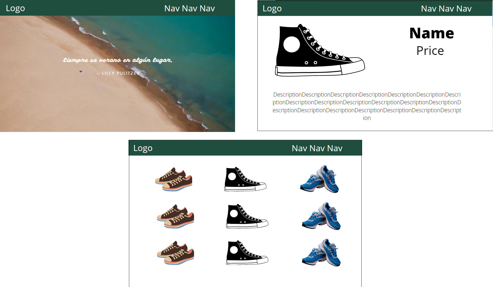

# capstone
A capstone project for inventory management. Could be scaled to be an ecommerce store.

Elevator Pitch: 

How do you increase productivity in the workplace? Increase the engagement of the employees in their tasks, and decrease wasted time looking for products.

Enter, this inventory management site. With a design that seeks to both relax and energize, while being easy on the eyes, the interactivity is meant to maintain engagement and add a playfulness to otherwise routine and monotonous tasks.

Further work could be done to alter this into an ecommerce site, but the focus would be shifted.

README Reqs:
    A link to your hosted working app.
        https://git.generalassemb.ly/dazeyb/capstone
        https://fast-springs-90912.herokuapp.com/

    Link to your user stories - who are your users, what do they want, and why?
    Link to your wireframes – sketches of major views / interfaces in your application.
    Link to your entity relationship diagrams – plan out your data relationships before coding.
    Descriptions of any unsolved problems or future features.

Technologies Used:

    MongoDB
    Express
    NodeJS

Installation Steps:
    Open the file, move into the folder in your terminal, and install all dependencies. 
    If on a windows device, type npm run dev in the terminal.
    Otherwise, you will have to alter the "dev" code in the package.json file.

User-Story: (Shopper)
Someone who is viewing the site to see what is in stock, and potentially make a purchase.

    On the homepage user will have a navbar that allows them to login, or signup. 
        On the front of this page there will be images of the products displayed, (perhaps a carousel), a statement about the company, etc.
        There will be a button front and center to check inventory/view stock/etc.

    This will take them to the search/index page, with the products already filled in on the right hand side.

    There will be a search filter for them to locate a product by price range, name, or type of product.

    When they make these changes and submit, they will be redirected with the new queried search to see the results in the same format as before, on the right hand side.

    Click on one of these will bring them to a show-page of that product, with more information.

Admin User-Story: (Employee)
Someone who would be working for the company to make changes to the inventory, or relay info about said inventory to use in market research/accounting/marketing/etc.
        
    As an admin, the user will be able to delete or update an item from the show page.

    From the index page, they will be able to add an item. This could also be placed into the navbar.

Pages: 
    Homepage
    Index Page
    Show Page
    Disclosure page

Page Layouts:

    Homepage:

            Navbar
                4 buttons
                    Login, Sign-up, Home, Index Page

            Carousel: 4 imgs (href tags to show page, or just company culture?)

            Fake Articles

            Top Product: Anchor tag to show page

            Footer

    Index Page:
        
            Navbar

            Search Filter

            Inventory Items

            Footer

    Show Page:

            Navbar
    

Stretch Goals: 

    Custom Cursor: https://web.archive.org/web/20170605131602/http://www.ajaxblender.com/howto-create-custom-image-cursors.html

    Searchbar

    Error handling

    Carousel: and imgs link to show pages

    Changes made to database are logged somewhere (Log page? New Model?)
        Reference who altered/deleted posts
    
    Favorite products/wishlist

    Integrate an API (widget!)

    Popup "This website uses cookies"

    Delete popup "Are you sure?"

    

